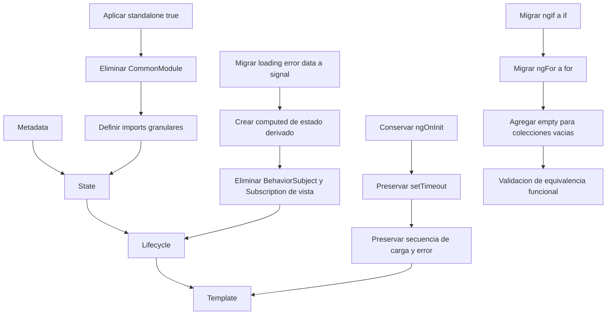

# Planificación Técnica - Refactorización Middleware Angular 15 -> 21

## 1. Objetivo de Plan

Este plan operacionaliza la especificación definida en MIGRACION_MIDDLEWARE.md para ejecutar una refactorización técnica lineal, sin alterar la lógica de negocio del middleware.

## 2. Estrategia de Estado Proactivo (Signal-based)

### 2.1 Objetivo de transformación

Transformar el flujo de estado de la vista desde un patrón basado en streams con suscripciones manuales hacia un patrón declarativo basado en señales, reduciendo complejidad de lifecycle y coste de detección de cambios.

### 2.2 Modelo objetivo

- Estado mutable local del componente: signal().
- Estado derivado (contadores, flags de presentación, proyecciones): computed().
- Side effects explícitos de sincronización de UI (si aplica): effect() con responsabilidad acotada.
- Plantilla: lectura directa del estado signal-based, eliminando dependencia de async pipe para estado local.

### 2.3 Principios operativos

- Fuente única de verdad por cada slice de estado de vista.
- Sin suscripciones manuales en el componente para estado local.
- Derivaciones calculadas de manera pura y determinista.
- Prohibida duplicación de estado entre estructuras RxJS y signals para el mismo dato.

### 2.4 Flujo de datos propuesto

1. Evento de ciclo de vida o interacción dispara acción de carga.
2. Señales de estado base se actualizan de manera transaccional (loading/error/data).
3. Computed recompone vistas derivadas (totales, estados agregados, etiquetas).
4. Template se re-renderiza por dependencia reactiva directa, sin subscribe/unsubscribe manual.

### 2.5 Criterios de aceptación de la estrategia

- Cero suscripciones manuales en el componente de middleware para estado de UI.
- Cero uso de async pipe para estado local migrado.
- Equivalencia funcional respecto a secuencia de carga, error y visualización.

## 3. Análisis de Dependencias (Capa de Vista)

## 3.1 Dependencias RxJS candidatas a eliminación en componente

En la capa de vista, al migrar a un estado Signal-based, dejan de ser necesarios de forma directa:

- BehaviorSubject
- Subject (si su uso era exclusivamente para eventos internos de UI)
- Subscription
- Observable para estado local (manteniendo posible uso en frontera de servicios)
- Operadores de composición orientados a template-state local: map, tap, filter, startWith, distinctUntilChanged, shareReplay (cuando solo servían para modelar estado de renderizado)

## 3.2 Dependencias Angular de template que se racionalizan

- AsyncPipe para estado local migrado.
- CommonModule como contenedor generalista para control flow clásico.

## 3.3 Impacto esperado en bundle

Impactos positivos esperados en el bundle final (dependientes del build real):

- Reducción de código de pegamento reactivo en componente (subscribe/unsubscribe y operadores de vista).
- Menor retención de utilidades RxJS en chunks de UI cuando no son requeridas por otras pantallas.
- Mejora de tree-shaking por reducir imports generalistas y adoptar imports granulares.
- Potencial reducción de parse/execute time en cliente por menor complejidad reactiva en runtime.

Nota de planificación: el impacto cuantitativo final se validará con mediciones de build comparando baseline versus objetivo en tamaño bruto, gzip y tiempo de evaluación JS.

## 4. Plan de Ejecución Lineal

### 4.1 Fase Metadata

- Consolidar definición standalone obligatoria.
- Sustituir imports generalistas por imports granulares estrictamente necesarios.

### 4.2 Fase State

- Migrar estado base a signal().
- Migrar estado derivado a computed().
- Eliminar estructuras RxJS redundantes en componente.

### 4.3 Fase Lifecycle

- Mantener ngOnInit como punto de inicio funcional.
- Conservar la llamada a carga sin modificar la lógica de setTimeout y manejo de datos.
- Eliminar patrones de cleanup derivados de suscripciones manuales que ya no apliquen.

### 4.4 Fase Template

- Reemplazar sintaxis estructural obsoleta por @if, @for y @empty.
- Conectar template con señales y derivados sin async pipe para estado local.

## 5. Mapa de Refactorización (Flujo Lineal)

## 6. Riesgos Técnicos y Mitigaciones

- Riesgo: mezclar paradigma RxJS y signals para el mismo estado.
- Mitigación: matriz de trazabilidad estado-anterior versus estado-objetivo.

- Riesgo: regresiones visuales al migrar control flow.
- Mitigación: checklist de equivalencia de escenarios (loading, error, lista con datos, lista vacia).

- Riesgo: variaciones de rendimiento no medidas.
- Mitigación: medición pre/post de TTI, tamaño de bundle y tiempo de evaluación.

## 7. Checklist de Aprobación de Plan

- Cumple secuencia Metadata -> State -> Lifecycle -> Template.
- Cumple eliminación de directivas estructurales obsoletas.
- Cumple migración de estado local a signals y derivados a computed.
- Cumple eliminación de suscripciones manuales de componente para estado local.
- Cumple preservación íntegra de lógica de negocio.
- Incluye estrategia de medición de TTI y bundle.
